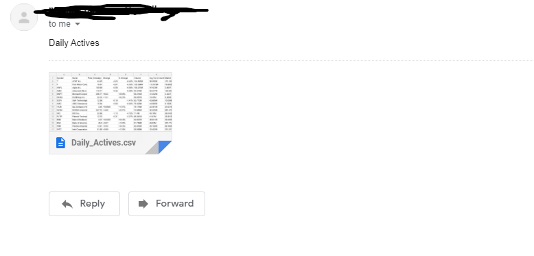

# Go-Yahoo-Finance-Daily-Actives

Scrape and convert the Yahoo Finance Daily Actives into a CSV file with headers, and optionally send yourself a copy of the file!

Make sure to set your email and password in config.email.env if you want to send the results to your email(not required)

### Sample Email sent with attatched csv

